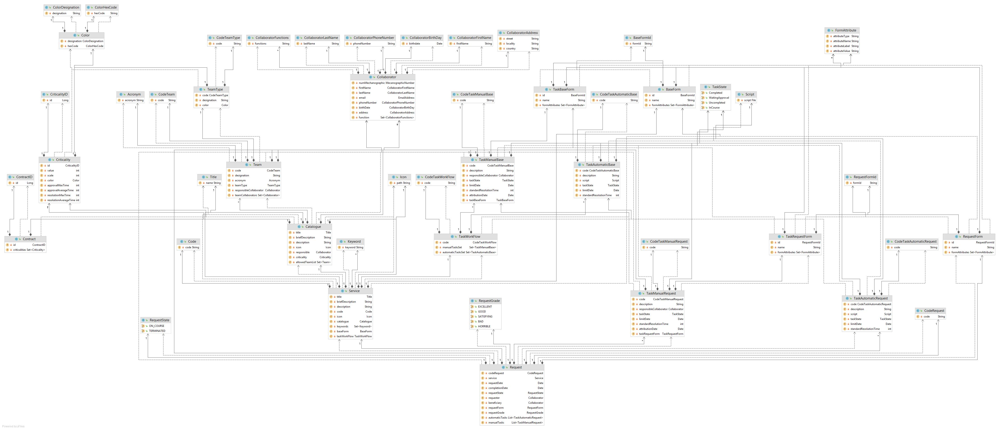

# README #

This repository contains didactic artifacts relevant to the integrative project to be developed during the second semester of the academic year of 2020-2021 in the [Degree in Informatics Engineering (LEI)](http://www.isep.ipp.pt/Course/Course/26) from [Instituto Superior de Engenharia do Porto (ISEP)](http://www.isep.ipp.pt), and is coordinated by team members from [Trello](https://trello.com/b/q06SJEZl/lapr4).

In particular, it has:

* [The team documentation during Sprints](docs)
* The Code Of The Application

### Application Overview

The following model diagram graphically represents the intended struture for the application where there is a clear separation (decoupling) between the domain classes and Value Objects. 

